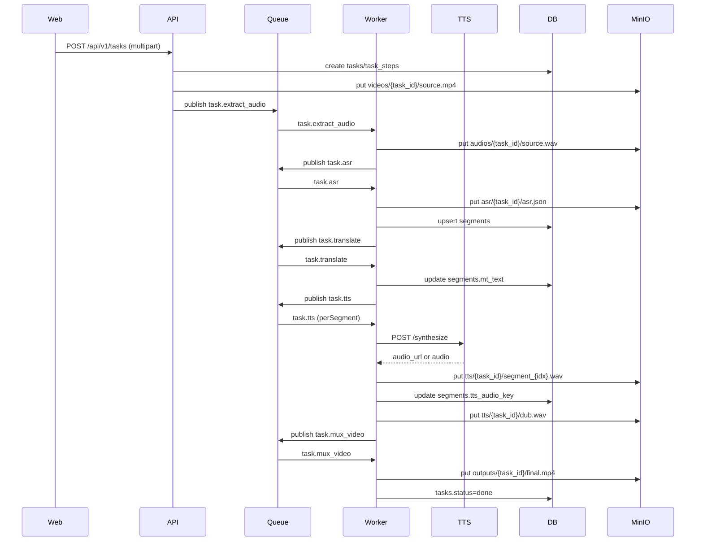

# 后续开发规划（端到端可演示闭环）

## 目标与范围
- **目标**：实现稳定闭环：`POST /api/v1/tasks` 上传视频 → RabbitMQ 编排 → Worker 完成 `extract_audio/asr/translate/tts/mux_video` → MinIO 产出 `outputs/{task_id}/final.mp4` → API 可查询状态与下载。
- **范围内（优先）**：真实外部 ASR（火山）与翻译（GLM）接入、TTS 服务从模拟切换到可用实现、`segment` 音频按时间轴合并生成 `dub.wav`、最终混流、E2E 演示脚本/最小前端。
- **范围外（后置）**：完整生产化（鉴权、配额、多租户、全链路监控系统）、字幕精修、效果深度优化。

## 现状基线（来自文档）
- API/Worker/TTS 框架已齐全；队列与数据模型已定义。
- 待补齐核心：外部 API 真接入、TTS 真合成、音频合并与时间对齐（见 `[DEVELOPMENT_PROGRESS.md](DEVELOPMENT_PROGRESS.md)`、`[docs/queue-messages.md](docs/queue-messages.md)`、`[docs/tts-service.md](docs/tts-service.md)`）。

## 推荐里程碑（2–4 周）

### Milestone A：跑通“真·外部ASR+翻译”并写入 `segments`
**目标**：`asr` 步骤把带时间戳结果落到 MinIO 的 `asr/{task_id}/asr.json`，并把分段写入 DB `segments`；`translate` 批量翻译更新 `segments.mt_text`。
- **主要改动**（预计）：
  - Worker：`[worker/internal/worker/steps.go](worker/internal/worker/steps.go)`（实现 `asr`/`translate` 真实调用与落库）
  - Worker 配置：`[worker/internal/config/config.go](worker/internal/config/config.go)`（外部 API 配置校验、超时、重试策略参数化）
  - 数据落库/幂等：对照 `[docs/data-model.md](docs/data-model.md)` 与 `[docs/queue-messages.md](docs/queue-messages.md)`
- **验收标准**：
  - 创建任务后，`segments` 表有正确 `idx/start_ms/end_ms/src_text`。
  - `translate` 后，所有 `segments.mt_text` 非空（可允许少量失败但必须可重试且能落到 task.error）。

### Milestone B：TTS 服务“可用化” + Worker 端 TTS 调用
**目标**：TTS 服务按 `[docs/tts-service.md](docs/tts-service.md)` 提供稳定的 `/synthesize`（至少 JSON 返回 `audio_url` 的路径可用）；Worker 可为每个 segment 调用并把 `tts/{task_id}/segment_{idx}.wav` 写入 MinIO，同时更新 `segments.tts_audio_key/tts_params_json`。
- **主要改动**（预计）：
  - TTS：`[tts_service/app/synthesizer.py](tts_service/app/synthesizer.py)`、`[tts_service/app/main.py](tts_service/app/main.py)`
  - Worker：`[worker/internal/worker/steps.go](worker/internal/worker/steps.go)`（`tts` 步骤：HTTP 客户端、超时、重试、错误映射）
- **验收标准**：
  - `/health` 返回 `model_loaded=true`（或明确的降级状态）。
  - 任意一个 segment 的 TTS 可产出可播放 wav，并在 MinIO/DB 中可追踪。

### Milestone C：音频合并（时间轴对齐）+ 最终混流
**目标**：实现 `dub.wav`：按 `segments.start_ms/end_ms` 将各段音频拼接/填充静音，时长与原音频/视频对齐；然后 `mux_video` 用 ffmpeg 替换音轨生成 `final.mp4`。
- **主要改动**（预计）：
  - Worker：`[worker/internal/worker/steps.go](worker/internal/worker/steps.go)`（新增“合并 segment 音频”的实现，并在 `mux_video` 前保证 `tts/{task_id}/dub.wav` 存在）
  - Worker 存储：`[worker/internal/storage/storage.go](worker/internal/storage/storage.go)`（下载/上传大文件的稳定性与临时文件管理）
- **验收标准**：
  - `tts/{task_id}/dub.wav` 时长与视频时长误差在可接受范围（例如 < 200ms 或按你们演示标准定）。
  - `outputs/{task_id}/final.mp4` 可播放且音轨来自 `dub.wav`。

### Milestone D：端到端演示体验（最小可视化）+ 可观测性兜底
**目标**：让答辩/演示稳定：一键起服务、可看到任务进度、失败可定位。
- **内容**：
  - **最小前端/演示页**：在 `web/` 实现上传+任务列表+状态轮询+下载按钮（不追求复杂 UI）。
  - **E2E 验收脚本**：提供一条命令或脚本跑完一次完整任务（含日志/trace_id 关联）。
  - **可观测性**：统一日志字段（task_id/step/trace_id）、关键耗时 metrics_json 写入 `task_steps`。
- **主要改动**（预计）：
  - API：`[api/internal/handlers/task.go](api/internal/handlers/task.go)`（返回字段完整性、下载链接一致性）
  - 网关：`[gateway/nginx.conf](gateway/nginx.conf)`（前端静态资源 + API 反代）
  - 前端（新）：`web/`（当前 README 标记待实现）
- **验收标准**：
  - 按 `[README.md](README.md)` 的 docker compose 启动方式，新环境 10 分钟内完成一次演示任务。
  - 失败时 `GET /api/v1/tasks/:id` 能看到明确错误信息与失败步骤。

## 关键数据流（对齐当前架构）

## 风险与对策（确保可演示）
- **外部 API 不稳定/限流**：所有调用必须有超时、重试（指数退避）、错误分类；必要时可降级到 mock（通过配置开关），保证演示不被卡死。
- **TTS 模型部署体积/资源**：优先保证“可用、稳定、可复现”，性能/效果后置；Docker volume `tts_models` 管理模型文件（见 `[docker-compose.yml](docker-compose.yml)`）。
- **时间轴对齐复杂**：第一版允许“按段拼接+静音填充”的可控策略，先满足同步与可听，再逐步优化。

## 开发节奏与提交（按你的要求）
- 每个里程碑完成后：按 `[README.md](README.md)` / `Makefile` 流程跑格式化/检查，再按 `[docs/commit-message.md](docs/commit-message.md)` 提交 git（小步、可回滚）。

## 实施 Todo（可直接照着做）
- A 完成后就能看到“有分段、有翻译”；B/C 完成后才真正有“配音视频”；D 负责“演示体验与稳定性”。