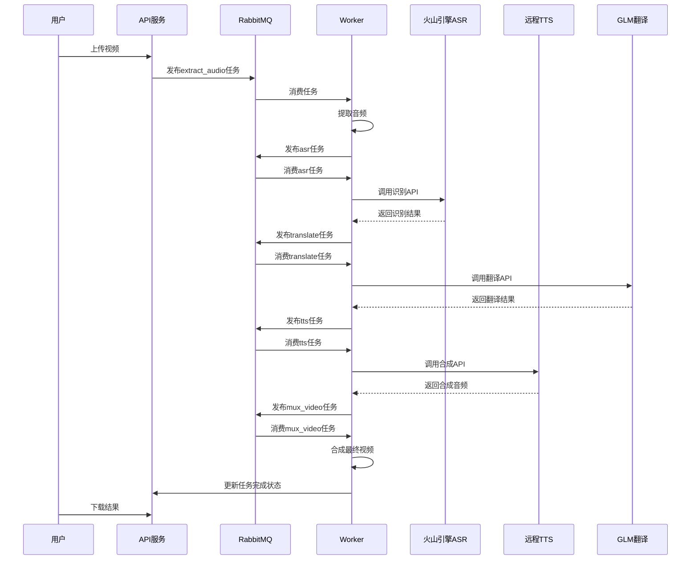

# 架构概览 - 重构后的纯API调用模式

> 更新日期：2026-01-23｜重构版本：API调用架构

## 架构理念

本项目已完全重构为**纯API调用架构**，不再依赖本地GPU资源和大型模型部署，通过调用外部API服务实现视频配音功能。

## 核心架构

```
┌─────────────────┐    ┌──────────────────┐    ┌─────────────────┐
│   Web 前端      │───▶│   API 服务 (Go)   │───▶│  Worker 服务    │
└─────────────────┘    └──────────────────┘    │      (Go)       │
                                ▲               └─────────────────┘
                                │                        ▲
                       ┌────────▼────────┐               │
                       │   基础设施层     │               │
                       │ - PostgreSQL   │               │
                       │ - MinIO        │               │
                       │ - RabbitMQ     │               │
                       │ - NGINX        │               │
                       └─────────────────┘               │
                                                        │
┌───────────────────────────────────────────────────────▼─────┐
│                    外部API服务层                            │
├─────────────────────┬─────────────────────┬──────────────────┤
│  火山引擎ASR API    │  远程TTS服务        │   GLM 翻译API    │
│  - 说话人分离       │  - index-tts-vllm   │  - 多语言翻译    │
│  - 情绪检测         │  - 可控时长合成     │  - 高质量输出    │
│  - 性别识别         │  - 并发支持         │  - API限流      │
└─────────────────────┴─────────────────────┴──────────────────┘
```

## 服务职责

### 1. API 服务 (api/)
- **REST API**: 提供任务创建、状态查询、结果下载接口
- **文件上传**: 处理视频文件上传到MinIO
- **任务编排**: 创建任务记录，启动处理流程
- **权限管理**: 基础的认证和授权（如需要）

### 2. Worker 服务 (worker/)
- **任务消费**: 从RabbitMQ消费处理任务
- **步骤执行**: 按顺序执行 `extract_audio` → `asr` → `translate` → `tts` → `mux_video`
- **外部API调用**: 调用火山引擎、GLM、TTS等外部服务
- **错误处理**: 失败重试、状态更新、异常上报

### 3. 基础设施层
- **PostgreSQL**: 任务状态、分段数据、配置信息
- **MinIO**: 视频文件、音频文件、处理结果存储
- **RabbitMQ**: 异步任务队列、步骤间消息传递
- **NGINX**: 反向代理、静态文件服务、负载均衡

## 外部服务集成

### 火山引擎 ASR
- **异步处理**: 提交任务 → 轮询结果
- **丰富输出**: 时间戳、说话人ID、情绪、性别
- **配置灵活**: 支持多种语言和检测功能开关

### 远程 TTS 服务
- **高性能**: 基于vLLM的index-tts-vllm，3x速度提升
- **并发支持**: 单GPU支持多并发请求
- **时长控制**: 根据原始时间轴约束合成音频

### GLM 翻译
- **高质量**: 基于大模型的自然翻译
- **多语言**: 支持中英日韩等主要语言
- **API限流**: 内置速率控制，避免超限

## 处理流程



## 重构收益

### 1. 资源优化
- ❌ **无需本地GPU**: 不再需要昂贵的GPU服务器
- ❌ **无大模型存储**: 节省几十GB的模型文件存储空间
- ✅ **按需使用**: 仅在处理时才调用API，无闲置成本

### 2. 性能提升
- ⚡ **TTS速度3倍提升**: 使用vLLM优化的推理引擎
- 🔄 **高并发支持**: 远程服务支持多任务并行处理
- 📈 **可扩展性**: 通过增加远程服务实例轻松扩容

### 3. 维护简化
- 🛠️ **代码量减少70%**: 移除大量本地推理代码
- 📦 **依赖简化**: 无需管理CUDA、PyTorch等重型依赖
- 🐳 **部署简单**: docker-compose一键启动，无需GPU支持

### 4. 功能增强
- 👥 **说话人分离**: 火山引擎支持10人以内说话人识别
- 😊 **情绪检测**: 识别语音情绪并保留到合成阶段
- 🎯 **更高精度**: 大模型API在识别和翻译质量上更优

## 配置管理

采用统一的环境变量配置，主要类别：

- **基础设施**: 数据库、MinIO、RabbitMQ连接信息
- **外部API**: 各服务的API Key、URL、参数配置
- **处理参数**: 批次大小、并发度、重试策略等

详见 `.env.example` 获取完整配置说明。

## 迁移指南

从旧版本(本地推理)迁移到新版本(API调用)的详细步骤请参考：
- [迁移指南](refactoring/asr重构设计方案.md)
- [TTS重构方案](refactoring/tts重构设计方案.md)
- [变更日志](refactoring/index-tts-vllm调研报告.md)