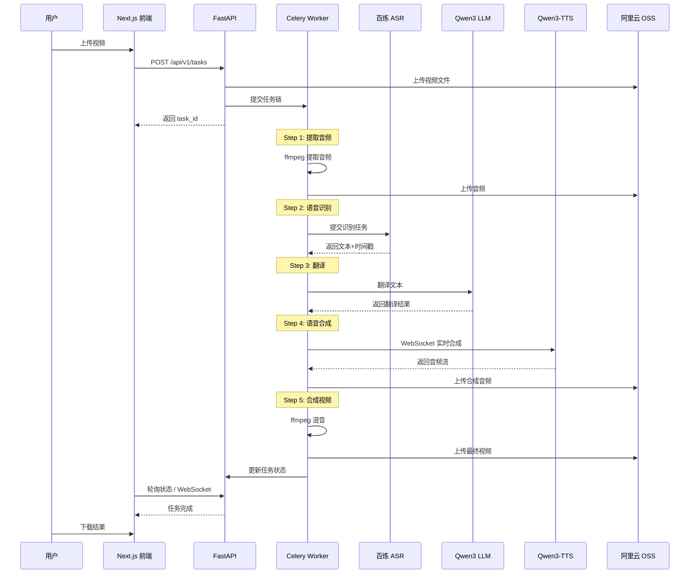

# 视频自动配音系统 - 全栈重构规划 V2

> 📅 规划日期：2026-02-02
> 🎯 目标：全面迁移至阿里百炼平台，前端 Next.js，后端 Python

---

## 📋 目录

1. [重构概述](#1-重构概述)
2. [技术栈对比](#2-技术栈对比)
3. [阿里百炼服务集成](#3-阿里百炼服务集成)
4. [新架构设计](#4-新架构设计)
5. [目录结构规划](#5-目录结构规划)
6. [分阶段实施计划](#6-分阶段实施计划)
7. [数据库设计](#7-数据库设计)
8. [API 设计](#8-api-设计)
9. [风险与缓解措施](#9-风险与缓解措施)

---

## 1. 重构概述

### 1.1 重构目标

| 维度 | 当前状态 | 目标状态 |
|------|----------|----------|
| **ASR** | 火山引擎 ASR API | 阿里百炼 DashScope ASR (fun-asr/sensevoice-v1) |
| **LLM** | GLM / DashScope (qwen-turbo) | DashScope Qwen3 |
| **TTS** | 远程 index-tts-vllm (GPU依赖) | 阿里百炼 qwen3-tts-vc-realtime (无GPU需求) |
| **OSS** | MinIO / 阿里云 OSS | 阿里云 OSS (统一) |
| **前端** | 待实现 / 静态 HTML | Next.js 14+ (App Router) |
| **后端** | Go (Gin/Echo) | Python (FastAPI) |
| **任务队列** | RabbitMQ | Celery + Redis (更 Python 生态) |

### 1.2 重构收益

- ✅ **统一云平台**：所有 AI 服务统一使用阿里百炼，简化密钥管理和计费
- ✅ **无 GPU 依赖**：TTS 改用云端 API，无需租用 GPU 服务器
- ✅ **技术栈统一**：后端全 Python，降低维护复杂度
- ✅ **现代前端**：Next.js 提供 SSR/SSG，更好的用户体验
- ✅ **成本优化**：按需付费的云 API，无闲置成本

---

## 2. 技术栈对比

### 2.1 前端技术栈

| 组件 | 当前 | 新方案 |
|------|------|--------|
| 框架 | 无 (静态 dist) | Next.js 14+ (App Router) |
| UI 库 | - | Tailwind CSS + shadcn/ui |
| 状态管理 | - | Zustand / React Query |
| 表单处理 | - | React Hook Form + Zod |
| 国际化 | - | next-intl |

### 2.2 后端技术栈

| 组件 | 当前 | 新方案 |
|------|------|--------|
| 语言 | Go 1.21+ | Python 3.11+ |
| Web 框架 | Gin/Echo | FastAPI |
| ORM | GORM/原生 SQL | SQLAlchemy 2.0 |
| 任务队列 | RabbitMQ | Celery + Redis |
| 依赖管理 | Go Modules | uv (快速现代) |
| API 文档 | 手写 | 自动生成 (OpenAPI) |

### 2.3 基础设施

| 组件 | 当前 | 新方案 |
|------|------|--------|
| 数据库 | PostgreSQL 15 | PostgreSQL 15 (保留) |
| 消息队列 | RabbitMQ | Redis (Celery broker) |
| 对象存储 | MinIO / OSS | 阿里云 OSS (统一) |
| 网关 | NGINX | NGINX (保留) |
| 容器 | Docker Compose | Docker Compose (保留) |

---

## 3. 阿里百炼服务集成

### 3.1 ASR - 录音文件识别

**服务信息：**
- 文档：https://help.aliyun.com/zh/model-studio/recording-file-recognition
- API 地址：`https://dashscope.aliyuncs.com/api/v1`
- 模型选项：
  - `fun-asr` - 通用识别，支持中英日韩等
  - `sensevoice-v1` - 情感检测，时长无限制
  - `paraformer-v2` - 高精度中文

**核心能力：**
```python
# 异步识别流程
from dashscope.audio.asr import Transcription

# 1. 提交任务
response = Transcription.async_call(
    model='sensevoice-v1',  # 支持情感检测
    file_urls=['https://oss.xxx/audio.mp3'],
    language_hints=['zh', 'en']
)
task_id = response.output.task_id

# 2. 轮询结果
result = Transcription.wait(task=task_id)
# 返回: 文本 + 时间戳 + 情感标签
```

**响应格式：**
```json
{
  "transcripts": [{
    "text": "你好世界",
    "sentences": [{
      "begin_time": 760,
      "end_time": 3240,
      "text": "你好世界",
      "words": [...]
    }]
  }]
}
```

### 3.2 LLM - Qwen3 翻译

**服务信息：**
- 模型：`qwen3-turbo` / `qwen3-plus` / `qwen3-max`
- API 地址：`https://dashscope.aliyuncs.com/compatible-mode/v1`
- 兼容 OpenAI 格式

**集成方式：**
```python
from openai import OpenAI

client = OpenAI(
    api_key=os.getenv("DASHSCOPE_API_KEY"),
    base_url="https://dashscope.aliyuncs.com/compatible-mode/v1"
)

response = client.chat.completions.create(
    model="qwen3-turbo",
    messages=[
        {"role": "system", "content": "你是专业的视频字幕翻译专家..."},
        {"role": "user", "content": f"将以下文本从{src_lang}翻译成{tgt_lang}:\n{text}"}
    ]
)
```

### 3.3 TTS - Qwen3-TTS-VC-Realtime

**服务信息：**
- 文档：https://help.aliyun.com/zh/model-studio/qwen-tts-realtime
- 模型：`qwen3-tts-vc-realtime-2026-01-15`
- WebSocket 地址：`wss://dashscope.aliyuncs.com/api-ws/v1/realtime`

**核心特性：**
- ✅ 实时流式合成
- ✅ 声音复刻（VC = Voice Clone）
- ✅ 多语言支持（中/英/日/韩等）
- ✅ 无需 GPU

**集成方式：**
```python
from dashscope.audio.tts_v2 import QwenTtsRealtime, AudioFormat

class TTSCallback:
    def __init__(self):
        self.audio_chunks = []

    def on_audio_data(self, data: bytes):
        self.audio_chunks.append(data)

    def get_audio(self) -> bytes:
        return b''.join(self.audio_chunks)

async def synthesize(text: str, voice: str = "Cherry") -> bytes:
    callback = TTSCallback()

    tts = QwenTtsRealtime(
        model='qwen3-tts-vc-realtime-2026-01-15',
        callback=callback,
        url='wss://dashscope.aliyuncs.com/api-ws/v1/realtime'
    )

    await tts.connect()
    await tts.update_session(
        voice=voice,
        response_format=AudioFormat.PCM_24000HZ_MONO_16BIT,
        language_type="Auto"
    )
    await tts.send_text(text)
    await tts.finish()

    return callback.get_audio()
```

**声音复刻流程：**
1. 上传参考音频（3-10秒）
2. 调用复刻接口生成专属 voice_id
3. 使用 voice_id 进行合成

### 3.4 OSS - 对象存储

**统一使用阿里云 OSS：**
```python
import oss2

auth = oss2.Auth(access_key_id, access_key_secret)
bucket = oss2.Bucket(auth, endpoint, bucket_name)

# 上传
bucket.put_object('videos/task_123/input.mp4', video_bytes)

# 生成签名 URL
url = bucket.sign_url('GET', 'videos/task_123/input.mp4', 3600)
```

---

## 4. 新架构设计

### 4.1 系统架构图

```
┌─────────────────────────────────────────────────────────────────┐
│                         用户浏览器                              │
└─────────────────────────────────────────────────────────────────┘
                              │
                              ▼
┌─────────────────────────────────────────────────────────────────┐
│                      NGINX 反向代理                             │
│  ┌─────────────────┐              ┌─────────────────────────┐  │
│  │ /api/* → :8000  │              │ /* → Next.js SSR :3000 │  │
│  └─────────────────┘              └─────────────────────────┘  │
└─────────────────────────────────────────────────────────────────┘
         │                                      │
         ▼                                      ▼
┌─────────────────┐                ┌─────────────────────────────┐
│  FastAPI 后端   │                │      Next.js 前端           │
│  (Python)       │                │      (React + SSR)          │
│  - REST API     │                │  - 任务管理页面             │
│  - WebSocket    │                │  - 进度实时显示             │
│  - 任务调度     │                │  - 结果预览播放             │
└─────────────────┘                └─────────────────────────────┘
         │
         ▼
┌─────────────────────────────────────────────────────────────────┐
│                      Celery Worker Pool                         │
│  ┌─────────────┐ ┌─────────────┐ ┌─────────────┐               │
│  │  Worker 1   │ │  Worker 2   │ │  Worker N   │               │
│  │ (任务执行)  │ │ (任务执行)  │ │ (任务执行)  │               │
│  └─────────────┘ └─────────────┘ └─────────────┘               │
└─────────────────────────────────────────────────────────────────┘
         │
         ▼
┌─────────────────────────────────────────────────────────────────┐
│                      阿里百炼平台 (DashScope)                    │
│  ┌──────────────┐  ┌──────────────┐  ┌──────────────┐          │
│  │     ASR      │  │   Qwen3 LLM  │  │  Qwen3-TTS   │          │
│  │ sensevoice   │  │   翻译服务    │  │   语音合成   │          │
│  └──────────────┘  └──────────────┘  └──────────────┘          │
└─────────────────────────────────────────────────────────────────┘
         │
         ▼
┌─────────────────────────────────────────────────────────────────┐
│                        基础设施层                                │
│  ┌──────────────┐  ┌──────────────┐  ┌──────────────┐          │
│  │  PostgreSQL  │  │    Redis     │  │  阿里云 OSS   │          │
│  │   任务状态   │  │ Celery Broker│  │   文件存储   │          │
│  └──────────────┘  └──────────────┘  └──────────────┘          │
└─────────────────────────────────────────────────────────────────┘
```

### 4.2 处理流程



---

## 5. 目录结构规划

```
video-auto-dubbing/
├── README.md
├── docker-compose.yml
├── .env.example
├── .gitignore
│
├── frontend/                      # Next.js 前端
│   ├── package.json
│   ├── next.config.js
│   ├── tailwind.config.js
│   ├── tsconfig.json
│   ├── app/                       # App Router
│   │   ├── layout.tsx
│   │   ├── page.tsx              # 首页
│   │   ├── tasks/
│   │   │   ├── page.tsx          # 任务列表
│   │   │   ├── [id]/
│   │   │   │   └── page.tsx      # 任务详情
│   │   │   └── new/
│   │   │       └── page.tsx      # 创建任务
│   │   └── api/                   # API Routes (可选 BFF)
│   ├── components/
│   │   ├── ui/                    # shadcn/ui 组件
│   │   ├── task-card.tsx
│   │   ├── upload-form.tsx
│   │   ├── progress-bar.tsx
│   │   └── video-player.tsx
│   ├── lib/
│   │   ├── api.ts                 # API 客户端
│   │   ├── utils.ts
│   │   └── hooks/
│   │       ├── use-task.ts
│   │       └── use-upload.ts
│   └── public/
│
├── backend/                       # Python FastAPI 后端
│   ├── pyproject.toml            # uv 依赖管理
│   ├── alembic.ini               # 数据库迁移
│   ├── app/
│   │   ├── __init__.py
│   │   ├── main.py               # FastAPI 入口
│   │   ├── config.py             # 配置管理
│   │   ├── database.py           # 数据库连接
│   │   │
│   │   ├── api/                   # API 路由
│   │   │   ├── __init__.py
│   │   │   ├── deps.py           # 依赖注入
│   │   │   ├── tasks.py          # 任务接口
│   │   │   ├── settings.py       # 设置接口
│   │   │   └── websocket.py      # WebSocket
│   │   │
│   │   ├── models/                # SQLAlchemy 模型
│   │   │   ├── __init__.py
│   │   │   ├── task.py
│   │   │   └── segment.py
│   │   │
│   │   ├── schemas/               # Pydantic 模型
│   │   │   ├── __init__.py
│   │   │   ├── task.py
│   │   │   └── segment.py
│   │   │
│   │   ├── services/              # 业务逻辑
│   │   │   ├── __init__.py
│   │   │   ├── task_service.py
│   │   │   └── storage_service.py
│   │   │
│   │   └── core/                  # 核心模块
│   │       ├── __init__.py
│   │       ├── security.py
│   │       └── exceptions.py
│   │
│   ├── workers/                   # Celery Workers
│   │   ├── __init__.py
│   │   ├── celery_app.py         # Celery 配置
│   │   ├── tasks.py              # 任务定义
│   │   │
│   │   └── steps/                 # 处理步骤
│   │       ├── __init__.py
│   │       ├── extract_audio.py
│   │       ├── asr.py            # 百炼 ASR
│   │       ├── translate.py      # Qwen3 LLM
│   │       ├── tts.py            # Qwen3-TTS
│   │       └── mux_video.py
│   │
│   ├── integrations/              # 外部服务集成
│   │   ├── __init__.py
│   │   ├── dashscope/
│   │   │   ├── __init__.py
│   │   │   ├── asr_client.py
│   │   │   ├── llm_client.py
│   │   │   └── tts_client.py
│   │   └── oss/
│   │       ├── __init__.py
│   │       └── client.py
│   │
│   ├── migrations/                # Alembic 迁移
│   │   └── versions/
│   │
│   └── tests/
│       ├── __init__.py
│       ├── conftest.py
│       ├── test_api/
│       └── test_workers/
│
├── gateway/                       # NGINX 配置
│   ├── nginx.conf
│   └── ssl/
│
├── scripts/                       # 运维脚本
│   ├── bootstrap.sh
│   ├── migrate.sh
│   └── backup.sh
│
├── docs/                          # 文档
│   ├── api-contracts.md
│   ├── deployment-guide.md
│   └── REFACTORING_PLAN_V2.md   # 本文档
│
└── backup/                        # 旧代码备份
    ├── api/                       # Go API 代码
    ├── worker/                    # Go Worker 代码
    └── tts_service/               # 旧 TTS 服务
```

---

## 6. 分阶段实施计划

### Phase 0: 准备工作 (1-2 天)

- [ ] 创建新分支 `feature/python-rewrite`
- [ ] 备份当前代码到 `backup/` 目录
- [ ] 申请并配置阿里百炼 API Key
- [ ] 测试各 API 服务连通性

### Phase 1: 基础设施搭建 (3-4 天)

**目标：** 搭建 Python 后端框架和 Next.js 前端骨架

- [ ] 初始化 FastAPI 项目结构
- [ ] 配置 SQLAlchemy + Alembic
- [ ] 配置 Celery + Redis
- [ ] 初始化 Next.js 项目
- [ ] 配置 Tailwind + shadcn/ui
- [ ] 更新 docker-compose.yml

**验证点：**
- FastAPI 服务启动，访问 `/docs` 看到 Swagger
- Next.js 开发服务器启动，看到首页
- Celery Worker 启动，能接收测试任务

### Phase 2: 阿里百炼服务集成 (4-5 天)

**目标：** 完成所有外部服务的 Python 客户端封装

#### 2.1 ASR 集成
- [ ] 封装 `dashscope.audio.asr.Transcription` 客户端
- [ ] 实现异步任务提交和轮询
- [ ] 解析识别结果（文本+时间戳+情感）
- [ ] 编写单元测试

#### 2.2 LLM 集成
- [ ] 封装 OpenAI 兼容的 Qwen3 客户端
- [ ] 实现批量翻译接口
- [ ] 添加速率限制
- [ ] 编写单元测试

#### 2.3 TTS 集成
- [ ] 封装 WebSocket 实时 TTS 客户端
- [ ] 实现音频流接收和拼接
- [ ] 支持声音复刻（可选）
- [ ] 编写单元测试

#### 2.4 OSS 集成
- [ ] 封装阿里云 OSS 客户端
- [ ] 实现上传/下载/签名 URL
- [ ] 编写单元测试

**验证点：**
- 能独立调用每个服务并获取正确响应
- 所有客户端测试通过

### Phase 3: 后端核心功能 (5-6 天)

**目标：** 完成任务管理和处理流水线

#### 3.1 数据模型
- [ ] Task 模型（状态机）
- [ ] Segment 模型（分段数据）
- [ ] 数据库迁移脚本

#### 3.2 API 接口
- [ ] `POST /api/v1/tasks` - 创建任务
- [ ] `GET /api/v1/tasks` - 任务列表
- [ ] `GET /api/v1/tasks/{id}` - 任务详情
- [ ] `GET /api/v1/tasks/{id}/result` - 下载结果
- [ ] `DELETE /api/v1/tasks/{id}` - 删除任务
- [ ] WebSocket 进度推送

#### 3.3 Celery 任务链
- [ ] extract_audio 任务
- [ ] asr 任务
- [ ] translate 任务
- [ ] tts 任务
- [ ] mux_video 任务
- [ ] 任务链编排（chain/group）

**验证点：**
- 通过 API 创建任务，能完整走完处理流程
- 数据库状态正确更新
- 文件正确存储到 OSS

### Phase 4: 前端开发 (4-5 天)

**目标：** 完成用户界面

#### 4.1 页面开发
- [ ] 首页（功能介绍）
- [ ] 任务列表页
- [ ] 创建任务页（上传表单）
- [ ] 任务详情页（进度+结果）

#### 4.2 组件开发
- [ ] 视频上传组件（拖拽+进度）
- [ ] 任务卡片组件
- [ ] 进度条组件（实时更新）
- [ ] 视频播放器组件

#### 4.3 状态管理
- [ ] API 客户端封装
- [ ] React Query 数据获取
- [ ] WebSocket 实时更新

**验证点：**
- 完整的用户流程可操作
- 进度实时更新
- 结果可预览和下载

### Phase 5: 集成测试与优化 (3-4 天)

- [ ] 端到端测试
- [ ] 性能优化（并发处理）
- [ ] 错误处理完善
- [ ] 日志和监控
- [ ] 文档更新

### Phase 6: 部署与迁移 (2-3 天)

- [ ] 生产环境 Docker 镜像构建
- [ ] docker-compose.prod.yml 配置
- [ ] 数据迁移脚本（如需保留历史数据）
- [ ] 灰度发布验证
- [ ] 旧代码归档

---

## 7. 数据库设计

### 7.1 Task 表

```sql
CREATE TABLE tasks (
    id UUID PRIMARY KEY DEFAULT gen_random_uuid(),

    -- 基本信息
    title VARCHAR(255),
    source_language VARCHAR(10) NOT NULL,
    target_language VARCHAR(10) NOT NULL,

    -- 状态
    status VARCHAR(20) NOT NULL DEFAULT 'pending',
    -- pending, extracting, transcribing, translating, synthesizing, muxing, completed, failed

    current_step VARCHAR(20),
    progress INTEGER DEFAULT 0,  -- 0-100
    error_message TEXT,

    -- 文件路径 (OSS)
    input_video_path VARCHAR(500),
    extracted_audio_path VARCHAR(500),
    output_video_path VARCHAR(500),

    -- 元数据
    video_duration_ms INTEGER,
    segment_count INTEGER,

    -- 时间戳
    created_at TIMESTAMP WITH TIME ZONE DEFAULT NOW(),
    updated_at TIMESTAMP WITH TIME ZONE DEFAULT NOW(),
    completed_at TIMESTAMP WITH TIME ZONE,

    -- Celery 任务 ID
    celery_task_id VARCHAR(100)
);

CREATE INDEX idx_tasks_status ON tasks(status);
CREATE INDEX idx_tasks_created_at ON tasks(created_at DESC);
```

### 7.2 Segment 表

```sql
CREATE TABLE segments (
    id UUID PRIMARY KEY DEFAULT gen_random_uuid(),
    task_id UUID NOT NULL REFERENCES tasks(id) ON DELETE CASCADE,

    -- 顺序
    segment_index INTEGER NOT NULL,

    -- 时间信息
    start_time_ms INTEGER NOT NULL,
    end_time_ms INTEGER NOT NULL,
    duration_ms INTEGER GENERATED ALWAYS AS (end_time_ms - start_time_ms) STORED,

    -- 文本内容
    original_text TEXT,
    translated_text TEXT,

    -- ASR 元数据
    speaker_id VARCHAR(50),
    emotion VARCHAR(20),  -- sensevoice 情感标签
    confidence FLOAT,

    -- TTS 音频路径
    audio_path VARCHAR(500),

    -- 时间戳
    created_at TIMESTAMP WITH TIME ZONE DEFAULT NOW(),
    updated_at TIMESTAMP WITH TIME ZONE DEFAULT NOW(),

    UNIQUE(task_id, segment_index)
);

CREATE INDEX idx_segments_task_id ON segments(task_id);
```

---

## 8. API 设计

### 8.1 任务管理

```yaml
POST /api/v1/tasks:
  description: 创建配音任务
  request:
    content-type: multipart/form-data
    body:
      video: file (required)
      source_language: string (required) # zh, en, ja, ko
      target_language: string (required)
      title: string (optional)
      voice: string (optional) # TTS 声音选择
  response:
    201:
      task_id: uuid
      status: pending
      created_at: datetime

GET /api/v1/tasks:
  description: 获取任务列表
  query:
    page: int (default: 1)
    page_size: int (default: 20)
    status: string (optional)
  response:
    200:
      items: Task[]
      total: int
      page: int
      page_size: int

GET /api/v1/tasks/{task_id}:
  description: 获取任务详情
  response:
    200:
      id: uuid
      title: string
      status: string
      progress: int
      current_step: string
      segments: Segment[]
      created_at: datetime
      completed_at: datetime | null

GET /api/v1/tasks/{task_id}/result:
  description: 获取处理结果下载链接
  response:
    200:
      download_url: string  # 签名的 OSS URL
      expires_in: int       # 秒

DELETE /api/v1/tasks/{task_id}:
  description: 删除任务
  response:
    204: No Content
```

### 8.2 WebSocket

```yaml
WS /api/v1/ws/tasks/{task_id}:
  description: 任务进度实时推送
  messages:
    progress:
      type: "progress"
      data:
        status: string
        current_step: string
        progress: int
        message: string
    completed:
      type: "completed"
      data:
        download_url: string
    error:
      type: "error"
      data:
        message: string
```

---

## 9. 风险与缓解措施

### 9.1 技术风险

| 风险 | 影响 | 缓解措施 |
|------|------|----------|
| TTS WebSocket 不稳定 | 合成失败 | 重试机制 + 降级到 HTTP 接口 |
| 长音频处理超时 | 任务失败 | 分段处理 + 异步轮询 |
| API 限流 | 处理变慢 | 速率限制 + 队列削峰 |

### 9.2 业务风险

| 风险 | 影响 | 缓解措施 |
|------|------|----------|
| 阿里云服务费用 | 成本超预期 | 监控用量 + 设置配额 |
| 翻译质量不稳定 | 用户体验差 | 人工审核入口 + 多轮优化 |

### 9.3 项目风险

| 风险 | 影响 | 缓解措施 |
|------|------|----------|
| 重构周期过长 | 业务中断 | 分阶段上线 + 保留旧系统 |
| 数据迁移失败 | 历史数据丢失 | 完整备份 + 迁移回滚方案 |

---

## 📌 下一步行动

1. **确认规划**：审阅本文档，确认技术选型和时间安排
2. **环境准备**：申请阿里百炼 API Key，测试连通性
3. **开始 Phase 0**：创建分支，备份代码
4. **启动 Phase 1**：搭建项目骨架

---

*文档版本：v2.0 | 最后更新：2026-02-02*
